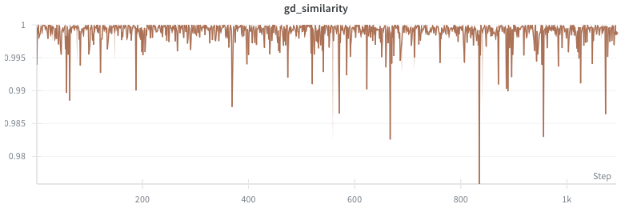
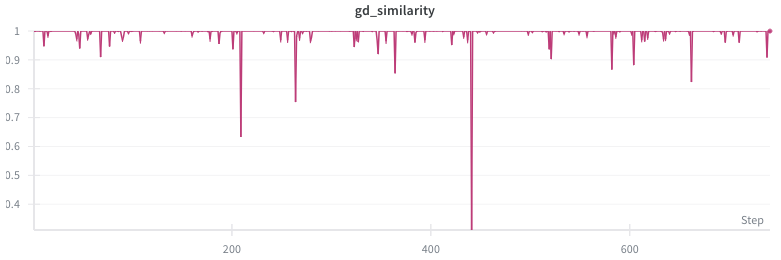
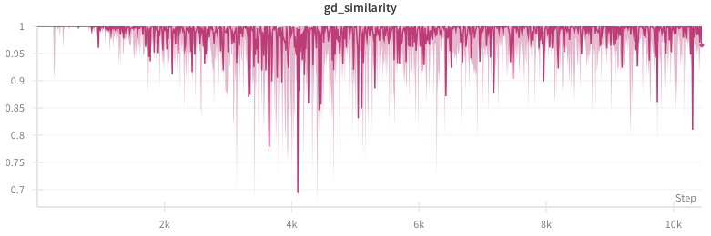
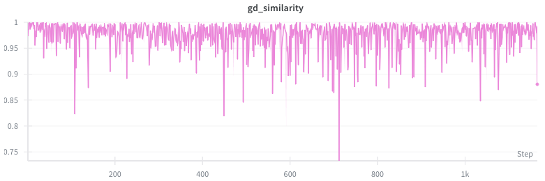

# Training a Tiny Recursive Network (TRM) using Jacobian Descent on ARC-AGI 2

The goal of this repo is to explore the potential of combining the proven successes from TRM on ARC-AGI 2 with the general multi objective optimization framework enabled by JD.

TRM is a recursive architecture inspired by HRM [paper](https://arxiv.org/abs/2110.13711) [code](https://github.com/sapientinc/HRM) which simplifies some design choices and performs better on the selected benchmarks. These two model architectures have made a big impact because of how few trainable parameters they use (respectively 7M and 27M).

JD is a framework for training effectively on multiple objectives, it is implemented by the library TorchJD which integrates conveniently with PyTorch and enables various number of setups. The paper proposes a preferred strategy called UPGrad which can be intuitively described as follows: *at every parameter update: take a step that guarantees no objective will be worsened will making general improvement*.

## Setup 1: Splitting the token prediction error and the halting penalty

TRM trains implicitly on two objectives: predicting the right output grid and knowing when to stop the supervisions process at training time. In the original implementation these two objectives are combined using a weighted sum but it is worth trying to split them into two objectives and optimizing each independently. This way the learning from one wouldn't harm the other objective.

This is implemented by the **lm_loss_vs_q_halt_loss** option. The experiments show that there is not much conflict between these two loss functions hence the overhead of JD doesn't result in a very different performance.

## Setup 2: Instance-Wise Risk Minization (IWRM)

This approach proposed in Section 3 of the paper considers each training sample as a distinct objective. This means that when training on a batch of tasks, we have the guarantee to make improvement on **all** tasks at the same time. This could potentially prevent the model from learning wrong shortcuts because if a reasoning path is correct, then it should help predicting the output for **all output grids**.

This is implemented by the **iwrm_q_halt_in** option. We can see that the cosine similary with a traditional Gradient Descent update is very close to 1 meaning that there is not much difference between the two methods.




## Setup 3: Pixel-Wise Split

This approach is novel and consists of splitting the losses by every single grid pixel that is predicted. Rather than summing the error over each predicted token we treat each as a separate objective which can result in 900 different losses for a 30x30 output grid. Since this corresponds to a huge overhead we also propose to apply a random grouping that will add up the errors into for example 10 different buckets and only run UPGrad on these 10 combined losses. Intuitively this should force the model to learn patterns that help predict all pixels at once. For instance the model should not learn to predict a grid that is just the background color because even if this will be right for most pixels it is clearly not accurate for all pixels in general.

This is implemented by the **pixelwise_q_halt_in** option. Again, the similarity is almost always 1 except for a few case where it goes down to ~0.3 but this is so rare that it doesn't change much in the final results.




## Setup 4: Refinements Split

This approach seemed like the most promising because of how nicely it integrates with the specificities of recurrent architectures. Since these models are trained to iterately improve their outputs, a meaningful choice is to consider each improvement step as a separate objective. This way the model should learn to make improvements after each refinement cycle in a way that will improve every step of the process. As explained in the [ablation study of HRM](https://arcprize.org/blog/hrm-analysis) by the ARC prize foundation, the refinement loop is a big driver of performance. Going from one to two cycles helps the performance jump from 19% to 32% on ARC-AGI 1. The gains are lower for higher cycles but this could potentially be explained by the conflicts in between improving different refinement step. The hope would then be that UPGrad could resolve this and then enable the model to leverage these cycles at their full potential.

Since TRM uses recurrence at multiple levels there are different possibilities about where to place the loss split. We implemented one at the higher level supervision process and one at the internal "reasoning" level. These two options can selected with the options **stack_supervisions_and_sum** and **stack_internal_and_sum**.

Stacking internal losses was very similar to GD at first but seemed to start diverging after quite some training time. It could be worth testing what happens afterwards...


Stacking supervisions is quite memory intense since we need to store several full computation graphs so we limited to 4 supervisions steps maximum. It clearly produces a different result compared to GD but in most situations seemed to plateau and didn't reach more than 3% solves on ARC-AGI 2 evaluation set.



## Setup 5: Hybrid approaches

Splitting methods can be combined together for example **iwrm_pixelwise_q_halt_in** or **stack_supervisions_and_iwrm**. The latter produces some interesting results as it seems to help preventing the model from giving up on more difficult tasks. I've encountered some situations where the model collapses and only predicts the tasks that it is able to solve and produce empty grids for the rest. IWRM helps overcoming that.



Here is a link to a W&B report demonstrating one of the best training run: [report](https://api.wandb.ai/links/kowadis/0fxss92i).

## Other attempts

### 1. Adding dropout didn't yield any significant improvement in generalization


### 2. Switching the loss to a differential loss produced some interesting results, overall performance was close to the original version but the model was sometime solving different puzzles which is worth mentioning. The goal was to guide the model more towards refining its previous outputs rather than producing the right answer at every shot.

$$differential\_loss = loss(logits_i - logits_{i-1})$$

### 3. Perturbation rate: the idea was to add some noise in between every refinement step at training time to perform a more robust reasoning trace. This feature still has some potential and requires further testing.

## EXTERNAL: Jacobian Descent with TorchJD  

[![Doc](https://img.shields.io/badge/Doc-torchjd.org-blue?logo=data%3Aimage%2Fsvg%2Bxml%3Bbase64%2CPD94bWwgdmVyc2lvbj0iMS4wIiBlbmNvZGluZz0iVVRGLTgiIHN0YW5kYWxvbmU9Im5vIj8%2BCjwhLS0gQ3JlYXRlZCB1c2luZyBLcml0YTogaHR0cDovL2tyaXRhLm9yZyAtLT4KCjxzdmcKICAgd2lkdGg9IjIwNDcuNzJwdCIKICAgaGVpZ2h0PSIyMDQ3LjcycHQiCiAgIHZpZXdCb3g9IjAgMCAyMDQ3LjcyIDIwNDcuNzIiCiAgIHZlcnNpb249IjEuMSIKICAgaWQ9InN2ZzEiCiAgIHNvZGlwb2RpOmRvY25hbWU9IlRvcmNoSkRfbG9nb19jaXJjdWxhci5zdmciCiAgIGlua3NjYXBlOnZlcnNpb249IjEuMy4yICgwOTFlMjBlZjBmLCAyMDIzLTExLTI1KSIKICAgeG1sbnM6aW5rc2NhcGU9Imh0dHA6Ly93d3cuaW5rc2NhcGUub3JnL25hbWVzcGFjZXMvaW5rc2NhcGUiCiAgIHhtbG5zOnNvZGlwb2RpPSJodHRwOi8vc29kaXBvZGkuc291cmNlZm9yZ2UubmV0L0RURC9zb2RpcG9kaS0wLmR0ZCIKICAgeG1sbnM9Imh0dHA6Ly93d3cudzMub3JnLzIwMDAvc3ZnIgogICB4bWxuczpzdmc9Imh0dHA6Ly93d3cudzMub3JnLzIwMDAvc3ZnIj4KICA8c29kaXBvZGk6bmFtZWR2aWV3CiAgICAgaWQ9Im5hbWVkdmlldzEiCiAgICAgcGFnZWNvbG9yPSIjZmZmZmZmIgogICAgIGJvcmRlcmNvbG9yPSIjNjY2NjY2IgogICAgIGJvcmRlcm9wYWNpdHk9IjEuMCIKICAgICBpbmtzY2FwZTpzaG93cGFnZXNoYWRvdz0iMiIKICAgICBpbmtzY2FwZTpwYWdlb3BhY2l0eT0iMC4wIgogICAgIGlua3NjYXBlOnBhZ2VjaGVja2VyYm9hcmQ9IjAiCiAgICAgaW5rc2NhcGU6ZGVza2NvbG9yPSIjZDFkMWQxIgogICAgIGlua3NjYXBlOmRvY3VtZW50LXVuaXRzPSJwdCIKICAgICBpbmtzY2FwZTp6b29tPSIwLjE2Mjk4NjE1IgogICAgIGlua3NjYXBlOmN4PSIxMzk1LjgyNDEiCiAgICAgaW5rc2NhcGU6Y3k9Ijg3NC4zMDczOSIKICAgICBpbmtzY2FwZTp3aW5kb3ctd2lkdGg9IjI1NjAiCiAgICAgaW5rc2NhcGU6d2luZG93LWhlaWdodD0iMTM3MSIKICAgICBpbmtzY2FwZTp3aW5kb3cteD0iMCIKICAgICBpbmtzY2FwZTp3aW5kb3cteT0iMCIKICAgICBpbmtzY2FwZTp3aW5kb3ctbWF4aW1pemVkPSIxIgogICAgIGlua3NjYXBlOmN1cnJlbnQtbGF5ZXI9InN2ZzEiIC8%2BCiAgPGRlZnMKICAgICBpZD0iZGVmczEiIC8%2BCiAgPHBhdGgKICAgICBpZD0ic2hhcGUxIgogICAgIGZpbGw9IiMwMDAwMDAiCiAgICAgZmlsbC1ydWxlPSJldmVub2RkIgogICAgIGQ9Ik0yNTUuMjE1IDg5OS44NzVMMjU1Ljk2NCAyNTUuOTY0TDc2Ny44OTMgMjU1Ljk2NEw3NjcuODkzIDBMMCAwTDAuMDMxMjUzMyA4OTguODQ0QzAuMDMxNzMwNSA4OTguODE0IDg0LjU3MjYgODk5Ljg3NSAyNTUuMjE1IDg5OS44NzVaIgogICAgIHN0eWxlPSJmaWxsOiMxYTgxZWI7ZmlsbC1vcGFjaXR5OjEiCiAgICAgdHJhbnNmb3JtPSJtYXRyaXgoMS4wMDAwMDAwMTQzMDcwNyAwIDAgMS4wMDAwMDAwMTQzMDcwNyAxMjcuOTgyMjI2NTIyMDU2IDEyNy45ODIyMjY1MjIwNTYpIiAvPgogIDxwYXRoCiAgICAgaWQ9InNoYXBlMDEiCiAgICAgdHJhbnNmb3JtPSJtYXRyaXgoLTEuMDAwMDAwMDA5MjIxODUgMCAwIC0xLjAwMDAwMDAwOTIyMTg1IDE5MTkuOTEzNjE3Mzk4NzEgMTkxMC4zMzcxOTY5MzEyNSkiCiAgICAgZmlsbD0iIzAwMDAwMCIKICAgICBmaWxsLXJ1bGU9ImV2ZW5vZGQiCiAgICAgZD0iTTc2OC4wNzQgMTc3Mi42MUMtMjgyLjAwNCAxNTk4LjY1IC0yMjkuNzEyIDE1MS44MjEgNzY4LjA3NCAwQzc2Ny4wODMgMjkuOTMzNyA3NjguMDk2IDE0Mi43NiA3NjguMDc0IDI2MC44ODZDNDEuNDc0NiA0NTYuOTAzIDEzNy40MjMgMTM4MC4wNiA3NjguMDc0IDE1MTMuNjQiCiAgICAgc3R5bGU9ImZpbGw6IzFhODFlYjtmaWxsLW9wYWNpdHk6MSIgLz4KICA8cGF0aAogICAgIGlkPSJzaGFwZTAyIgogICAgIGZpbGw9IiMwMDAwMDAiCiAgICAgZmlsbC1ydWxlPSJldmVub2RkIgogICAgIGQ9Ik03NjcuOTA5IDg4Ny4zMzhDMjYzLjQwMiA4MDMuOTI2IDAuMDc1OTQyMSAzODcuOTY0IDAgMC4wODU2NDk3QzE0LjY4NjggLTAuMDI4NTQ5OSA5OS4wNTUxIC0wLjAyODU0OTkgMjU1LjAxMSAwLjA4NTY0OTdDMjU1LjMxMSAyODEuMTE0IDQ0OC43ODYgNTYyLjE2MyA3NjcuOTA5IDYyNi40OTkiCiAgICAgc3R5bGU9ImZpbGw6IzFhODFlYjtmaWxsLW9wYWNpdHk6MSIKICAgICB0cmFuc2Zvcm09Im1hdHJpeCgwLjk5OTk5OTk2MDczODQ0IDAgMCAwLjk5OTk5OTk2MDczODQ0IDEyNy45NjY1OTE0OTQzMjggMTAyMy43NzIxNDc4MzE0KSIgLz4KICA8ZWxsaXBzZQogICAgIHN0eWxlPSJmaWxsOiMxYTgxZWI7c3Ryb2tlLXdpZHRoOjEuMDY3OTtmaWxsLW9wYWNpdHk6MSIKICAgICBpZD0icGF0aDEiCiAgICAgY3g9IjEwMjYuMzYxIgogICAgIGN5PSIxMDE0LjIyMTEiCiAgICAgcng9IjE4My4yNTU0MyIKICAgICByeT0iMTgzLjUxNTU4IiAvPgo8L3N2Zz4K)](https://torchjd.org)

TorchJD is a library extending autograd to enable
[Jacobian descent](https://arxiv.org/pdf/2406.16232) with PyTorch. It can be used to train neural
networks with multiple objectives. In particular, it supports multi-task learning, with a wide
variety of aggregators from the literature. It also enables the instance-wise risk minimization
paradigm. The full documentation is available at [torchjd.org](https://torchjd.org), with several
usage examples.

## Jacobian descent (JD)
Jacobian descent is an extension of gradient descent supporting the optimization of vector-valued
functions. This algorithm can be used to train neural networks with multiple loss functions. In this
context, JD iteratively updates the parameters of the model using the Jacobian matrix of the vector
of losses (the matrix stacking each individual loss' gradient). For more details, please refer to
Section 2.1 of the [paper](https://arxiv.org/pdf/2406.16232).

### How does this compare to averaging the different losses and using gradient descent?

Averaging the losses and computing the gradient of the mean is mathematically equivalent to
computing the Jacobian and averaging its rows. However, this approach has limitations. If two
gradients are conflicting (they have a negative inner product), simply averaging them can result in
an update vector that is conflicting with one of the two gradients. Averaging the losses and making
a step of gradient descent can thus lead to an increase of one of the losses.

This is illustrated in the following picture, in which the two objectives' gradients $g_1$ and $g_2$
are conflicting, and averaging them gives an update direction that is detrimental to the first
objective. Note that in this picture, the dual cone, represented in green, is the set of vectors
that have a non-negative inner product with both $g_1$ and $g_2$.


With Jacobian descent, $g_1$ and $g_2$ are computed individually and carefully aggregated using an
aggregator $\mathcal A$. In this example, the aggregator is the Unconflicting Projection of
Gradients $\mathcal A_{\text{UPGrad}}$: it
projects each gradient onto the dual cone, and averages the projections. This ensures that the
update will always be beneficial to each individual objective (given a sufficiently small step
size). In addition to $\mathcal A_{\text{UPGrad}}$, TorchJD supports
[more than 10 aggregators from the literature](https://torchjd.org/stable/docs/aggregation).


## EXTERNAL: Less is More: Recursive Reasoning with Tiny Networks

This is the codebase for the paper: "Less is More: Recursive Reasoning with Tiny Networks". TRM is a recursive reasoning approach that achieves amazing scores of 45% on ARC-AGI-1 and 8% on ARC-AGI-2 using a tiny 7M parameters neural network.

[Paper](https://arxiv.org/abs/2510.04871)

### Motivation

Tiny Recursion Model (TRM) is a recursive reasoning model that achieves amazing scores of 45% on ARC-AGI-1 and 8% on ARC-AGI-2 with a tiny 7M parameters neural network. The idea that one must rely on massive foundational models trained for millions of dollars by some big corporation in order to achieve success on hard tasks is a trap. Currently, there is too much focus on exploiting LLMs rather than devising and expanding new lines of direction. With recursive reasoning, it turns out that “less is more”: you don’t always need to crank up model size in order for a model to reason and solve hard problems. A tiny model pretrained from scratch, recursing on itself and updating its answers over time, can achieve a lot without breaking the bank.

This work came to be after I learned about the recent innovative Hierarchical Reasoning Model (HRM). I was amazed that an approach using small models could do so well on hard tasks like the ARC-AGI competition (reaching 40% accuracy when normally only Large Language Models could compete). But I kept thinking that it is too complicated, relying too much on biological arguments about the human brain, and that this recursive reasoning process could be greatly simplified and improved. Tiny Recursion Model (TRM) simplifies recursive reasoning to its core essence, which ultimately has nothing to do with the human brain, does not require any mathematical (fixed-point) theorem, nor any hierarchy.

### How TRM works

<p align="center">
  
</p>

Tiny Recursion Model (TRM) recursively improves its predicted answer y with a tiny network. It starts with the embedded input question x and initial embedded answer y and latent z. For up to K improvements steps, it tries to improve its answer y. It does so by i) recursively updating n times its latent z given the question x, current answer y, and current latent z (recursive reasoning), and then ii) updating its answer y given the current answer y and current latent z. This recursive process allows the model to progressively improve its answer (potentially addressing any errors from its previous answer) in an extremely parameter-efficient manner while minimizing overfitting.

### Requirements

- Python 3.10 (or similar)
- Cuda 12.6.0 (or similar)

```bash
pip install --upgrade pip wheel setuptools
pip install --pre --upgrade torch torchvision torchaudio --index-url https://download.pytorch.org/whl/nightly/cu126 # install torch based on your cuda version
pip install -r requirements.txt # install requirements
pip install --no-cache-dir --no-build-isolation adam-atan2 
wandb login YOUR-LOGIN # login if you want the logger to sync results to your Weights & Biases (https://wandb.ai/)
```

### Dataset Preparation

```bash
# ARC-AGI-1
python -m dataset.build_arc_dataset \
  --input-file-prefix kaggle/combined/arc-agi \
  --output-dir data/arc1concept-aug-1000 \
  --subsets training evaluation concept \
  --test-set-name evaluation

# ARC-AGI-2
python -m dataset.build_arc_dataset \
  --input-file-prefix kaggle/combined/arc-agi \
  --output-dir data/arc2concept-aug-1000 \
  --subsets training2 evaluation2 concept \
  --test-set-name evaluation2

## Note: You cannot train on both ARC-AGI-1 and ARC-AGI-2 and evaluate them both because ARC-AGI-2 training data contains some ARC-AGI-1 eval data

# Sudoku-Extreme
python dataset/build_sudoku_dataset.py --output-dir data/sudoku-extreme-1k-aug-1000  --subsample-size 1000 --num-aug 1000  # 1000 examples, 1000 augments

# Maze-Hard
python dataset/build_maze_dataset.py # 1000 examples, 8 augments
```

## Experiments

### ARC-AGI-1 (assuming 4 H-100 GPUs):

```bash
run_name="pretrain_att_arc1concept_4"
torchrun --nproc-per-node 4 --rdzv_backend=c10d --rdzv_endpoint=localhost:0 --nnodes=1 pretrain.py \
arch=trm \
data_paths="[data/arc1concept-aug-1000]" \
arch.L_layers=2 \
arch.H_cycles=3 arch.L_cycles=4 \
+run_name=${run_name} ema=True

```

*Runtime:* ~3 days

### ARC-AGI-2 (assuming 4 H-100 GPUs):

```bash
run_name="pretrain_att_arc2concept_4"
torchrun --nproc-per-node 4 --rdzv_backend=c10d --rdzv_endpoint=localhost:0 --nnodes=1 pretrain.py \
arch=trm \
data_paths="[data/arc2concept-aug-1000]" \
arch.L_layers=2 \
arch.H_cycles=3 arch.L_cycles=4 \
+run_name=${run_name} ema=True

```

*Runtime:* ~3 days

### Sudoku-Extreme (assuming 1 L40S GPU):

```bash
run_name="pretrain_mlp_t_sudoku"
python pretrain.py \
arch=trm \
data_paths="[data/sudoku-extreme-1k-aug-1000]" \
evaluators="[]" \
epochs=50000 eval_interval=5000 \
lr=1e-4 puzzle_emb_lr=1e-4 weight_decay=1.0 puzzle_emb_weight_decay=1.0 \
arch.mlp_t=True arch.pos_encodings=none \
arch.L_layers=2 \
arch.H_cycles=3 arch.L_cycles=6 \
+run_name=${run_name} ema=True

run_name="pretrain_att_sudoku"
python pretrain.py \
arch=trm \
data_paths="[data/sudoku-extreme-1k-aug-1000]" \
evaluators="[]" \
epochs=50000 eval_interval=5000 \
lr=1e-4 puzzle_emb_lr=1e-4 weight_decay=1.0 puzzle_emb_weight_decay=1.0 \
arch.L_layers=2 \
arch.H_cycles=3 arch.L_cycles=6 \
+run_name=${run_name} ema=True
```

*Runtime:* < 36 hours

## Hyperparameter Sweep

To perform automated hyperparameter optimization using Weights & Biases, you can use the provided sweep script:

```bash
python sweep.py
```

This will:
- Create a Bayesian optimization sweep over architecture parameters (H_cycles, L_cycles, hidden_size, num_heads)
- Run 20 trials to find optimal hyperparameters using distributed training with torchrun
- Use 8 GPUs per trial by default (configurable in sweep.py)
- Log results to wandb for analysis
- Optimize for validation accuracy

The sweep configuration can be customized in `sweep.py` to sweep over different parameters or use different optimization strategies.

### Maze-Hard (assuming 4 L40S GPUs):

```bash
run_name="pretrain_att_maze30x30"
torchrun --nproc-per-node 4 --rdzv_backend=c10d --rdzv_endpoint=localhost:0 --nnodes=1 pretrain.py \
arch=trm \
data_paths="[data/maze-30x30-hard-1k]" \
evaluators="[]" \
epochs=50000 eval_interval=5000 \
lr=1e-4 puzzle_emb_lr=1e-4 weight_decay=1.0 puzzle_emb_weight_decay=1.0 \
arch.L_layers=2 \
arch.H_cycles=3 arch.L_cycles=4 \
+run_name=${run_name} ema=True
```

*Runtime:* < 24 hours

## Reference

If you find our work useful, please consider citing:

```bibtex
@misc{jolicoeurmartineau2025morerecursivereasoningtiny,
      title={Less is More: Recursive Reasoning with Tiny Networks}, 
      author={Alexia Jolicoeur-Martineau},
      year={2025},
      eprint={2510.04871},
      archivePrefix={arXiv},
      primaryClass={cs.LG},
      url={https://arxiv.org/abs/2510.04871}, 
}
```

and the Hierarchical Reasoning Model (HRM):

```bibtex
@misc{wang2025hierarchicalreasoningmodel,
      title={Hierarchical Reasoning Model}, 
      author={Guan Wang and Jin Li and Yuhao Sun and Xing Chen and Changling Liu and Yue Wu and Meng Lu and Sen Song and Yasin Abbasi Yadkori},
      year={2025},
      eprint={2506.21734},
      archivePrefix={arXiv},
      primaryClass={cs.AI},
      url={https://arxiv.org/abs/2506.21734}, 
}
```

This code is based on the Hierarchical Reasoning Model [code](https://github.com/sapientinc/HRM) and the Hierarchical Reasoning Model Analysis [code](https://github.com/arcprize/hierarchical-reasoning-model-analysis).
